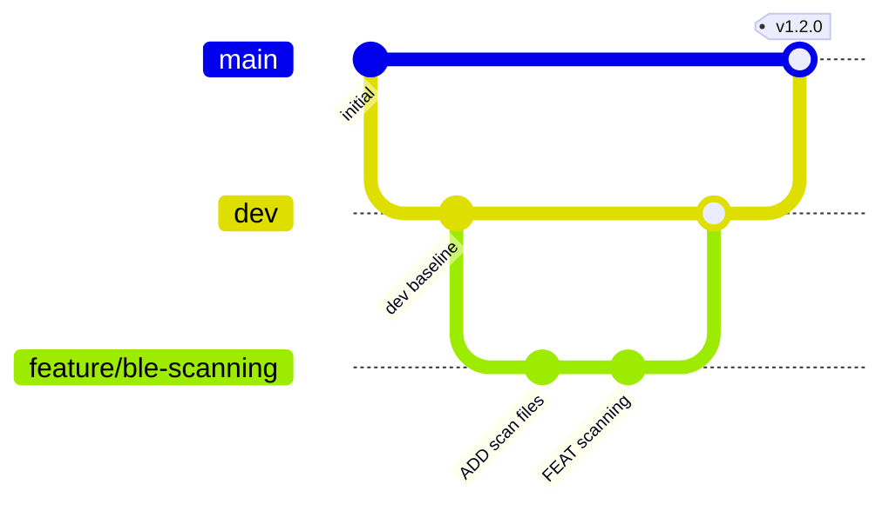
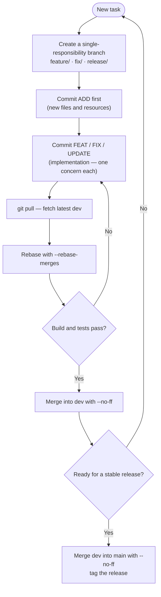
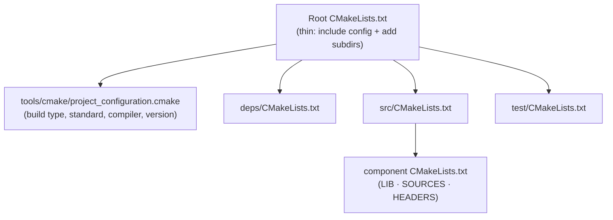
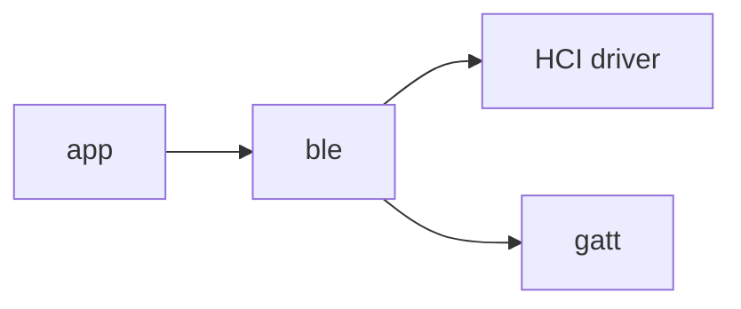
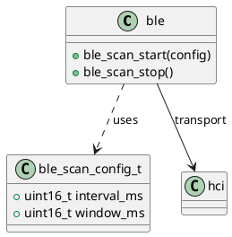

# Development Conventions

A single source of truth for how work is carried out in this project. It covers the Git workflow,
commit and branch conventions, project layout, the build system, coding style,
and versioning.

<br><br>

## Core Principle — One Branch, One Responsibility

> Every meaningful task gets its **own branch**, and every branch does
> **exactly one thing**.

Do not bundle unrelated work into a branch — not even "harmless" extras such as
formatting or clean-up. If you notice something else that needs doing, give it
its own branch. This keeps history readable, reviews focused, and reverts safe.

---

<br><br>

## Table of Contents

1. [Git Workflow](#git-workflow)
2. [Commit Conventions](#commit-conventions)
3. [Project Structure](#project-structure)
4. [Build System (CMake)](#build-system-cmake)
5. [Coding Style](#coding-style)
6. [Encapsulation](#encapsulation)
7. [Testing (TDD)](#testing-tdd)
8. [Documentation](#documentation)
9. [README & Changelog](#readme--changelog)
10. [Versioning](#versioning)

---

<br><br>

## Git Workflow

<br><br>

### Branch Model

Two long-lived branches anchor the repository, and short-lived branches fan out
from `dev` for actual work.

| Branch          | Pattern             | Purpose                                | Example                  |
| --------------- | ------------------- | -------------------------------------- | ------------------------ |
| **main**        | `main`              | Stable releases only                   | `main`                   |
| **dev** *(default)* | `dev`           | Stable, integrated development         | `dev`                    |
| feature         | `feature/<name>`    | New capability                         | `feature/ble-scanning`   |
| test            | `test/<name>`       | Test scenarios, declared before code   | `test/ble-scanning`      |
| bugfix          | `fix/<name>`        | Bug fix                                | `fix/connection-timeout` |
| hotfix          | `hotfix/<name>`     | Urgent fix on a release                | `hotfix/memory-leak`     |
| release         | `release/<version>` | Release preparation                    | `release/v1.2.0`         |

Rules:

- Never use the name `master` — use `main`.
- `main` holds **stable releases only**; `dev` holds **stable development**.
- **Never commit directly** to `main` or `dev`.
- **Only `dev`** may be merged into `main`.



<br><br>

### Branch Naming

| ✅ Do                              | ❌ Don't                                       |
| --------------------------------- | --------------------------------------------- |
| Use lowercase                     | `Feature/BLE`                                 |
| Separate words with `-` or `/`    | `feature_ble` (underscore)                    |
| Be descriptive (2–4 words)        | `fix/a`                                        |
| Include the issue / ticket ID     | `fix/123-connection` *(good)*                 |
| Keep it under 50 characters       | `feature/add-very-long-descriptive-name`      |

When a branch maps to a tracked issue or ticket, embed the ID:

```
feature/123-ble-scanning
fix/456-connection-timeout
hotfix/789-memory-leak
feature/JIRA-42-add-sensor
```

<br><br>

### Merging & Rebasing

- Always `git pull` to fetch the latest changes **before** rebasing or merging.
- Use `git rebase --rebase-merges` so merge commits survive a rebase.
- Use `git merge --no-ff` to preserve the branch topology in the graph.
- **Never** use `pull` to perform the merge itself.
- **Never** merge a buggy branch — especially one that fails to build.

<br><br>

### Task Lifecycle

The end-to-end flow, from a fresh task to a tagged release:



---

<br><br>

## Commit Conventions

<br><br>

### Single Responsibility

Each commit must address **one** concern. Within a branch, introduce new files
**before** the logic that uses them: commit the `[ADD]` first, then commit the
implementation. This makes each step reviewable and bisect-friendly. A typical
sequence on an implementation branch:

```
[ADD]  Create sensor driver headers and skeleton
[FEAT] Implement temperature sampling loop
```

The tests that cover this work are declared and merged *first*, on their own
branch — see [Testing (TDD)](#testing-tdd).

<br><br>

### Message Format

A commit message has a **subject** and, when needed, a **body**, separated by a
single blank line:

```
[<TAG>] <short imperative summary>
<blank line>
<body — explain what changed and, above all, why>
```

Follow the widely adopted commit-message rules:

1. **Use the imperative mood** in the subject — phrase it as a command given to
   the codebase, not as a past-tense report. A good subject completes the
   sentence: *"If applied, this commit will **\<subject>**."*
   - ✅ `[FIX] Correct retry timeout calculation`
   - ❌ `[FIX] Corrected retry timeout` · `[FIX] fixes the timeout`
2. **Separate subject from body** with one blank line.
3. **Keep the subject to ~50 characters** (tag included) so it stays scannable.
4. **Capitalize** the description that follows the tag.
5. **Wrap the tag in square brackets with no colon** — `[ADD] Summary`, never
   `ADD: Summary`.
6. **Do not end the subject with a period.**
7. **Wrap the body at 72 characters.**
8. **Use the body to explain _what_ and _why_, not _how_** — the diff already
   shows how. Capture the motivation and the problem being solved; that context
   cannot be reconstructed from the code later.

> **Why this matters:** a terse, non-descriptive subject — or an auto-generated
> GitHub merge title — forces every later reader to reverse-engineer your intent
> from the diff. The subject says *what*; the body preserves the *why*.

<br><br>

### Commit Tags

Prefix every subject with a tag wrapped in **square brackets**, with **no
colon** — `[ADD] Summary`, never `ADD: Summary`. Use one of these tags:

| Tag      | Use for                                                              |
| -------- | ------------------------------------------------------------------- |
| `ADD`    | New files or resources                                              |
| `FEAT`   | A new feature or capability                                         |
| `FIX`    | Bug fixes                                                           |
| `UPDATE` | Modifications, refactoring, improvements                           |
| `PERF`   | Performance improvements (memory / execution time)                 |
| `TEST`   | Adding or changing tests                                           |
| `DOC`    | Documentation changes                                              |
| `REMOVE` | Deleting files                                                     |
| `STYLE`  | Formatting only, no logic change — e.g. `[STYLE] Format with clang-format` |

<br><br>

### Example

```
[FEAT] Add BLE scanning to the central role

The central previously connected only to a hard-coded peer. Scanning lets
it discover advertising peripherals at runtime and select one by RSSI,
which is required for the multi-sensor setup.

Scanning stops automatically once a connection is established, keeping the
radio duty cycle within budget.
```

---

<br><br>

## Project Structure

A predictable layout keeps sources, public headers, tests, and tooling cleanly
separated.

```
.
├── build/                  # Build output (generated)
├── CMakeLists.txt          # Thin root CMake
├── deps/                   # External / third-party libraries (has its own root CMakeLists.txt)
│   └── boards/             # Board overlays
├── doc/                    # All project documentation (.md)
│   ├── architecture.md
│   ├── build.md
│   └── introduction.md
├── include/                # Public headers, each under an <project_name>/ folder
├── prj.conf
├── README.md
├── src/                    # All sources and private headers
│   ├── app.c
│   ├── alg/                # Algorithms (crc, dsp, …)
│   ├── comm/               # Communication (control, peripheral)
│   ├── common/             # Shared headers
│   └── hal/                # Hardware abstraction (ble, uart, …)
├── test/                   # Test sources; options live in test/CMakeLists.txt
└── tools/                  # Dev tooling: clang-tidy, clang-format, CMake scripts
    └── clang/              # .clang-format lives here
```

| Folder     | Responsibility                                                           |
| ---------- | ------------------------------------------------------------------------ |
| `deps/`    | All external libraries and third parties; owns a root `CMakeLists.txt`.  |
| `doc/`     | All Markdown documentation for the project.                              |
| `include/` | Public headers, each nested under a `<project_name>/` folder.            |
| `src/`     | All source files and **private** headers.                               |
| `test/`    | All test files; test options are configured in `test/CMakeLists.txt`.    |
| `tools/`   | Development tooling (clang-tidy, clang-format, CMake helper scripts).    |

---

<br><br>

## Build System (CMake)

<br><br>

### Layering

Keep the **root `CMakeLists.txt` as thin as possible**. It should only pull in
shared configuration and add sub-directories. Push all shared settings — build
type, language standard, compiler flags, project name, and version — into
`tools/cmake/project_configuration.cmake` and include it from the root.



<br><br>

### Module Libraries

Every module is built as its **own static library**, in its own folder, with
its own `CMakeLists.txt` — whether it is a nested component (e.g. `dsp`, `crc`
under `alg/`) or a stand-alone one (e.g. `uart`, `ble`). The main application
and the test executable **link** these libraries; a module's sources are never
compiled directly into the application. This keeps each module independently
buildable, testable, and reusable.

<br><br>

### Naming Conventions

| Variable      | Holds                                   |
| ------------- | --------------------------------------- |
| `SOURCES`     | Source files (always defined)           |
| `HEADERS`     | Header files (always defined)           |
| `LIB`         | A library target name                   |
| `APP`         | An executable target name               |
| `TEST_APP`    | A testing executable target name        |

Additional rules:

- Store every executable/library name in a variable; never hard-code it.
- Write multi-line lists one entry per line, indented with **4 spaces**.

<br><br>

### File Sections

Every `CMakeLists.txt` is split into the same ordered, comment-delimited
sections so each file reads identically. Head each one with a `#` comment, in
this order; omit a section only when it has nothing to declare:

| Order | Section title           | Contains                                                              |
| ----- | ----------------------- | --------------------------------------------------------------------- |
| 1     | `# Find Package`        | `find_package(...)` calls and dependency discovery                    |
| 2     | `# Variables`           | `set(...)` for `LIB`/`APP`/`TEST_APP`, `SOURCES`, `HEADERS`, dirs      |
| 3     | `# Executable`          | The target — `add_library(...)` or `add_executable(...)`              |
| 4     | `# Include Directories` | `target_include_directories(...)`                                     |
| 5     | `# Linking`             | `target_link_libraries(...)`                                          |
| 6     | `# Compile Definitions` | `target_compile_definitions(...)`                                     |

The **root** `CMakeLists.txt` adds these sections (kept thin — shared settings
live in `project_configuration.cmake`):

| Section title     | Contains                                                       |
| ----------------- | -------------------------------------------------------------- |
| `# Version`       | `PROJECT_VERSION` / `PROJECT_VERSION_SUFFIX` defaults          |
| `# Information`   | `cmake_minimum_required(...)`, `project(...)`, status messages |
| `# Configuration` | Language standard, build type, compiler flags                  |
| `# Sub Directory` | `add_subdirectory(...)` for `deps`, `src`, `test`              |

<br><br>

### Component Template

Each buildable component follows the same section order — find packages,
declare variables, define the target, then includes and links:

```cmake
# Find Package

# Variables
set(LIB control_comm)
set(SOURCES
    control.c
    control_comm.c
)
set(HEADERS
    control.h
    control_comm.h
)

# Executable
add_library(${LIB} STATIC ${SOURCES} ${HEADERS})

# Include Directories
target_include_directories(${LIB} PRIVATE ${PRIVATE_INCLUDE_DIRS})

# Linking
target_link_libraries(${LIB} PRIVATE uart)
```

---

<br><br>

## Coding Style

<br><br>

### Naming Rules

- **Minimum 3 characters** per name — no cryptic one- or two-letter identifiers.
- **Append the unit** to the end of each entity's name, so the dimension is
  unambiguous at the point of use.

| ✅ Good          | ❌ Avoid     | Why                              |
| ---------------- | ----------- | -------------------------------- |
| `timeout_ms`     | `timeout`   | Unit (milliseconds) is explicit  |
| `voltage_mv`     | `v`         | Descriptive **and** has a unit   |
| `temperature_c`  | `temp`      | Clear quantity and unit          |

<br><br>

### Data Types

- **Use the fixed-width types from `<stdint.h>`** (`int8_t`, `uint16_t`,
  `int32_t`, …) instead of the built-in `char`/`short`/`int`/`long`, whose
  widths are platform-dependent. On embedded targets the exact size of every
  field must be known and predictable.
- **Prefer unsigned types** wherever a value cannot be negative — counts, sizes,
  indices, register and bit-field values. Reserve signed types for quantities
  that genuinely need a sign.

| ✅ Good                  | ❌ Avoid        | Why                                            |
| ------------------------ | -------------- | ---------------------------------------------- |
| `uint16_t voltage_mv;`   | `int voltage;` | Fixed width; an unsigned reading can't go below 0 |
| `uint8_t retry_count;`   | `int retries;` | Width is explicit; a count is never negative   |
| `int32_t temperature_c;` | `long temp;`   | Fixed width; signed only because it may be negative |

<br><br>

### Namespacing

C has no namespaces, so emulate them: **prefix every public API and exported
entity with its module name**. The prefix acts as the namespace, prevents symbol
clashes, and makes ownership obvious at the call site.

- Functions follow `<module>_<action>()` — `ble_scan_start()`, `uart_write()`.
- Types and constants share the prefix — `ble_scan_config_t`, `UART_BAUD_115200`.

<br><br>

### Types & Typedefs

- **`typedef` every `enum`, `struct`, and `union`** so the bare type name is used
  without repeating the `struct`/`enum` keyword at each declaration.
- Give the typedef a module prefix and a trailing `_t` — `sensor_config_t`,
  `ble_state_t`.

```c
typedef enum
{
    BLE_STATE_IDLE,
    BLE_STATE_SCANNING,
    BLE_STATE_CONNECTED,
} ble_state_t;
```

<br><br>

### `const` Correctness

- Apply **`const` as widely as possible** — to every value that is never
  reassigned, and to every pointer whose target the function does not modify.
- For read-only pointer parameters, `const`-qualify the pointee everywhere:

```c
uint16_t crc16_compute(const uint8_t *data_in, size_t length_bytes);
```

- `const` documents intent, lets the compiler reject accidental writes, and
  unlocks optimisations.

<br><br>

### Conditional Expressions

- **Put the read-only operand on the left** of an equality test, so a mistyped
  single `=` becomes a compile error instead of a silent assignment.
  - ✅ `if (NULL == ptr)` · `if (BLE_STATE_IDLE == state)`
  - ❌ `if (ptr == NULL)` — a typo `ptr = NULL` would still compile
- **Parenthesise each sub-condition** of a compound expression; never rely on
  operator precedence.
  - ✅ `if ((a > b) && (c < d))`
  - ❌ `if (a > b && c < d)`

<br><br>

### Macros

- **Avoid the preprocessor wherever the language offers a typed alternative:**
  - `enum` or `static const` instead of `#define` constants.
  - `static inline` functions instead of function-like macros.
- Macros bypass type checking and scoping; reserve them for what C cannot
  otherwise express (header guards, conditional compilation).

<br><br>

### TODO Comments

Every `TODO` left in the code carries an **owner tag** in parentheses immediately
after the keyword. The tag is the **initials of the developer's first name and
family name** — the person who put the TODO there, not the person it eventually
falls to. The initials let a reader walk straight to whoever has the context,
and they survive moves and rewrites better than a bare `TODO` that anonymises
the trail.

```
// TODO(MN): Split per2cen data and vice versa
// TODO(MN): Use data_ namespace instead of pkt_
```

Rules:

- Use the developer's **first-name + family-name initials** in uppercase,
  inside parentheses, with no extra spaces — `TODO(MN):`, not `TODO (MN) :`.
- A short, imperative sentence follows the colon, explaining what still needs
  doing — *not* why the code is the way it is (that goes in the surrounding
  comment or commit message).
- Never strip another developer's tag when touching their TODO; if you take
  ownership of it, add yours alongside — `TODO(MN, AS):` — so the history is
  preserved.
- The same tagging rule applies to `FIXME`, `XXX`, and `HACK` markers.

<br><br>

### Standards (MISRA C)

All C code must conform to **MISRA C** (e.g. MISRA C:2012). The rules in this
guide — fixed-width typing, `const`-correctness, explicit parentheses, minimal
macros, and encapsulation — align with MISRA. Where this guide is silent, treat
MISRA C as the authority.

<br><br>

### Formatting (clang-format)

Formatting is enforced by `.clang-format` (kept in `tools/clang/`), based on the
**Linux-kernel style**. Key settings:

| Setting             | Value                                                    |
| ------------------- | -------------------------------------------------------- |
| Indentation         | 4 spaces, **never** tabs                                 |
| Column limit        | 100                                                      |
| Pointer alignment   | Right — `int *ptr`                                       |
| Function braces     | On their **own** line                                    |
| `struct`/`enum` braces | On their **own** line                                 |
| Control braces      | On the **same** line — `if (cond) {`                     |
| Assignments         | Consecutive `=` are aligned                              |
| Keyword spacing     | Space after `if`/`for`/`while`; none after a call's name |

The same C source after formatting:

```c
#include <errno.h>
#include <stddef.h>
#include <stdint.h>

#include "sensor.h"

static const uint16_t SENSOR_DEFAULT_MV = 3300u;

typedef enum
{
    SENSOR_STATE_IDLE,
    SENSOR_STATE_SAMPLING,
    SENSOR_STATE_ERROR,
} sensor_state_t;

typedef struct
{
    uint32_t timeout_ms;
    uint16_t voltage_mv;
    uint8_t retry_count;
} sensor_config_t;

int sensor_read_temperature_celsius(const sensor_config_t *config,
                                    int32_t *out_temperature_celsius)
{
    if ((NULL == config) || (NULL == out_temperature_celsius)) {
        return -EINVAL;
    }

    uint16_t supply_mv  = SENSOR_DEFAULT_MV;
    uint8_t attempt_idx = 0;

    for (attempt_idx = 0; attempt_idx < config->retry_count; ++attempt_idx) {
        if (0 == sensor_sample_once(config, supply_mv, out_temperature_celsius)) {
            return 0;
        }
    }

    return -ETIMEDOUT;
}
```

Notice how several conventions combine: the function's `{` drops to its own line
while the `if`/`for` braces stay inline; pointers bind to the name and the
read-only `config` is `const`; equality tests put the constant on the left and
parenthesise each sub-condition; the `enum` and `struct` are `typedef`'d; the
constant is a `static const`, not a macro; consecutive assignments have their
`=` aligned; and every name carries its unit (`timeout_ms`, `voltage_mv`).

---

<br><br>

## Encapsulation

Expose the **smallest possible surface**. Anything that need not be visible
outside its translation unit or module stays private by default.

- **Use `static` as much as possible.** Every function and file-scope variable
  used in only one `.c` file must be `static`, keeping it off the global symbol
  table and out of other modules' reach.
- **Separate public and private headers.** Public APIs (the module-prefixed
  entities) live in `include/<project_name>/`; everything else stays in `src/`.
- **`#undef` file-local macros at the end of the source** that defined them, so
  they cannot leak through later includes or pollute other translation units.

```c
#define LOCAL_BUFFER_LEN 64u
/* ... used only within this file ... */

#undef LOCAL_BUFFER_LEN   /* at end of file */
```

---

<br><br>

## Testing (TDD)

Develop with **Test-Driven Development** — let the tests drive the code:

1. **Red** — write a failing test that captures the desired behaviour.
2. **Green** — write the minimum code needed to make it pass.
3. **Refactor** — improve the code while the tests stay green.

<br><br>

### Test-First Branch Workflow

Tests come **before** the implementation, and on their **own** branch:

1. Branch `test/<name>` off `dev` and **declare the test scenarios** there —
   the cases that capture the desired behaviour (they fail at first: red).
2. **Implement those tests** on the same branch and commit them with the
   `[TEST]` tag.
3. **Merge `test/<name>` into `dev`** once the scenarios are in place.
4. **Only then** branch `feature/<name>` (or `fix/<name>`) off the updated
   `dev` and write the implementation that turns the tests green.

This guarantees every capability has its acceptance criteria recorded and
reviewed *before* any production code is written.

<br><br>

### Framework & Layout

- Unit tests use **[Catch2](https://github.com/catchorg/Catch2)** (v3), vendored
  under `deps/catch2/` and built as a static library.
- Tests live under `test/` and build as a **separate executable** via the
  `TEST_APP` target in `test/CMakeLists.txt`; `TEST_APP` links the module
  libraries under test plus `catch2`.
- Track test work with the `[TEST]` commit tag.
- A branch whose tests fail must never be merged (see **Merging & Rebasing**).

---

<br><br>

## Documentation

Every module carries its own Markdown document so the design is discoverable
without reading the source. All documentation lives in `doc/` and is **updated
in the same commit as the code it describes** (a `DOC` commit), so it never
drifts out of date.

<br><br>

### Per-Module Documents

- Add one `doc/<module>.md` for **each module** — e.g. `doc/ble.md`,
  `doc/uart.md`, `doc/crc.md`.
- Whenever a module's public API, behaviour, or dependencies change, update its
  document as part of the same change.

<br><br>

### Project-Level Guides

Besides per-module docs, `doc/` holds project-wide guides that the `README.md`
links to:

- `doc/build.md` — **How to Build**: prerequisites, configure, build, and flash
  steps. Linked from the README so build instructions live in one place.
- `doc/architecture.md` — system architecture overview.
- `doc/introduction.md` — project introduction.

<br><br>

### Required Sections

Each `doc/<module>.md` follows the same ordered headings; omit a section only
when it genuinely does not apply:

| Section               | Purpose                                              |
| --------------------- | ---------------------------------------------------- |
| `# <Module>` (title)  | The module name.                                     |
| `## Introduction`     | What the module is and why it exists.                |
| `## Responsibilities` | What it owns, and what is explicitly out of scope.   |
| `## Public API`       | The exported, module-prefixed functions and types.   |
| `## Usage Example`    | A short, copy-pasteable snippet.                     |
| `## Relationships`    | How it connects to others — Mermaid flowchart + UML. |
| `## Dependencies`     | Other modules and libraries it relies on.            |

<br><br>

### Diagrams

- **Flowcharts** (behaviour and data flow) are written inline as **Mermaid**.
- **UML** (class, sequence, component) is written in **PlantUML**, stored as
  `.puml` files under `doc/uml/`, and linked from the module document. Keeping
  UML in `.puml` keeps it versioned and independently renderable.

<br><br>

### Example

A concise `doc/ble.md`:

````markdown
# BLE

## Introduction
The BLE module owns Bluetooth Low Energy scanning and connection setup for the
central role.

## Responsibilities
- Scan for advertising peripherals and select one by RSSI.
- Establish and tear down a single connection.
- Out of scope: GATT service logic (see the `gatt` module).

## Public API
| Function                                          | Description     |
| ------------------------------------------------- | --------------- |
| `ble_scan_start(const ble_scan_config_t *config)` | Begin scanning. |
| `ble_scan_stop(void)`                             | Stop scanning.  |

## Usage Example
```c
const ble_scan_config_t config = {
    .interval_ms = 100u,
    .window_ms   = 50u,
};
ble_scan_start(&config);
```

## Relationships


UML class diagram: [uml/ble.puml](uml/ble.puml)

## Dependencies
- `hci` — radio transport.
- Zephyr Bluetooth host stack.
````

The linked `doc/uml/ble.puml`:



---

<br><br>

## README & Changelog

<br><br>

### Project README

The root `README.md` is the project's entry point — the first thing a new
reader (or AI agent) sees. Keep it current and use these ordered sections;
include each that applies:

| Section                       | Purpose                                                        |
| ----------------------------- | -------------------------------------------------------------- |
| **Title & tagline**           | Project name and a one-line description of what it does.       |
| **Badges** *(optional)*       | Build status, latest version, license.                         |
| **Description / Overview**    | What the project is, who it is for, and its key features.      |
| **Requirements**              | Toolchain, SDK versions (e.g. Zephyr, nRF Connect), hardware.  |
| **Getting Started / Build**   | Clone, configure, build, and flash commands.                   |
| **Usage**                     | How to run it, with a minimal example.                         |
| **Project Structure**         | Short tree or a link to these conventions.                     |
| **Documentation**             | Links into `doc/` (per-module docs).                           |
| **Testing**                   | How to build and run the tests.                                |
| **Versioning**                | The scheme used, plus a link to `CHANGELOG.md`.                |
| **Contributing**              | A link to this development-conventions document.               |
| **License**                   | The license name (and a link to the `LICENSE` file).           |

Rules:

- Name the file exactly `README.md` (lowercase extension).
- Lead with a one-line description; keep prose short and link out for detail.
- Show commands in fenced code blocks so they are copy-pasteable.

<br><br>

### README Example

````markdown
### README Example

````markdown
# Project Name

A short, one-line description of what this project does.

## Description
A brief overview of the project, its purpose, and its key features.

## Requirements
- Required SDK or toolchain with version
- Required hardware or dependencies

## Build
See [How to Build](doc/build.md) for the full setup, build, and flash steps.

## Usage
Brief description of how to run or deploy the project.

## Documentation
- [How to Build](doc/build.md)
- [Architecture](doc/architecture.md)
- [Module A](doc/module_a.md)

## Versioning
Semantic Versioning. See [CHANGELOG.md](CHANGELOG.md).

## License
License name — see [LICENSE](LICENSE).
````

<br><br>

### Changelog

Track every notable change in a root `CHANGELOG.md` following
[Keep a Changelog](https://keepachangelog.com) and
[Semantic Versioning](https://semver.org):

- Keep an `## [Unreleased]` section at the top for changes not yet released.
- Head each release with `## [X.Y.Z] - YYYY-MM-DD`; **newest version first**.
- Group entries under these categories (only those that apply):
  **Added**, **Changed**, **Deprecated**, **Removed**, **Fixed**, **Security**.
- Write entries for humans, in the past/declarative tense, one bullet per change.
- Bump the version per the rules in [Bumping `MAJOR.MINOR.PATCH`](#bumping-majorminorpatch).

<br><br>

### Changelog Example

```markdown
# Changelog

All notable changes to this project are documented in this file.
The format is based on Keep a Changelog, and this project adheres to
Semantic Versioning.

## [Unreleased]
### Added
- RSSI-based peripheral selection during scanning.

## [1.2.0] - 2026-05-27
### Added
- BLE scanning for the central role.
### Fixed
- Connection timeout when reconnecting to a known peer.

## [1.1.0] - 2026-04-10
### Changed
- Moved CMake configuration into tools/cmake/project_configuration.cmake.
```

---

<br><br>

## Versioning

- Use **semantic versioning**, starting from `0.0.0`.
- The version is defined in CMake; local builds carry a `-dev` suffix, while
  CI/CD release builds carry none (see [Version Suffix](#version-suffix)).
- Generate a `version.h` from CMake so code can read a human-readable version.

<br><br>

### Bumping `MAJOR.MINOR.PATCH`

The three numbers describe **how large the change is**, not how long it took.
Pick the smallest bump that still tells the truth:

| Bump      | Use when                                                                                     | Examples                                                       |
| --------- | -------------------------------------------------------------------------------------------- | -------------------------------------------------------------- |
| **MAJOR** | A big refactor or a change in observable behaviour — public APIs, wire format, or semantics. | Renaming the protocol enum range; replacing the RSSI pipeline. |
| **MINOR** | A whole part is added or a module is reworked — bigger than a patch, smaller than a rewrite. | Adding a new BLE module; reworking the config message handler. |
| **PATCH** | Tiny changes — bug fixes, small tweaks, comment or doc edits, formatting follow-ups.         | Fixing a CRC off-by-one; correcting a typo in a log string.    |

Rules of thumb:

- If a downstream consumer has to **change their code** to keep building, it
  is at least a `MINOR` bump; if their code still builds but **behaves
  differently**, it is a `MAJOR`.
- Doc-only or whitespace-only commits do **not** bump the version on their own;
  they ride along with the next real change.
- The version bump happens on the `release/<version>` branch (see
  [Branch Model](#branch-model)) in a single dedicated commit, so the bump is
  easy to spot in `git log`.

```cmake
# Version (set in project_configuration.cmake)
if (NOT DEFINED PROJECT_VERSION)
    set(PROJECT_VERSION "0.1.0")
endif()
if (NOT DEFINED PROJECT_VERSION_SUFFIX)
    set(PROJECT_VERSION_SUFFIX "-dev")
endif()
```

The version and suffix are then exposed to the compilation as definitions
(e.g. `PROJECT_VERSION` / `PROJECT_VERSION_SUFFIX`) and surfaced in code through
the generated `version.h`.

<br><br>

### Version Suffix

The full version is `MAJOR.MINOR.PATCH` plus a **suffix** that records how the
binary was built. `PROJECT_VERSION_SUFFIX` defaults to `-dev`, so any build made
by hand is clearly marked as in-development; the release pipeline clears it.

| Build origin             | Suffix    | Example     | Meaning                             |
| ------------------------ | --------- | ----------- | ----------------------------------- |
| Local — IDE or terminal  | `-dev`    | `1.2.0-dev` | A development build, not a release. |
| CI/CD from a release tag | *(empty)* | `1.2.0`     | An official, reproducible release.  |

- Local/manual builds keep the default `-dev` suffix — no extra flags needed.
- The CI/CD release job builds from a version tag and passes an empty suffix
  (e.g. `-DPROJECT_VERSION_SUFFIX=`), producing a clean `MAJOR.MINOR.PATCH`.
